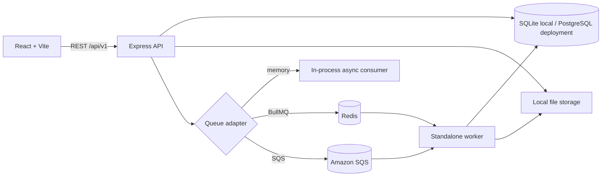

# Architecture

TalentCloud is a TypeScript monorepo with a React single-page client, Express API, Prisma relational data layer, file storage adapter, and queue-backed resume processing.

## Application boundaries

- `frontend/src/pages` contains marketplace and dashboard screens. `AuthContext` restores the session through `/auth/me`; `apiFetch` attaches the bearer token.
- `backend/src/modules` groups API handlers by domain. Authentication middleware reloads the user and profile IDs on each protected request and rejects suspended accounts.
- `backend/prisma/schema.prisma` is the local SQLite schema. `schema.postgres.prisma` is used to generate the PostgreSQL client in the container image.
- The memory queue is useful for demos but is process-local and not durable. BullMQ uses Redis; BullMQ and SQS are consumed by a separate `worker.ts` process.
- Resume files use local storage or S3 with random keys. Downloads stream through the API after owner/participant authorization.

## AWS status

The project has PostgreSQL, S3, and SQS adapters and a container topology for API, worker, PostgreSQL, and Redis. AWS infrastructure templates, IAM policies, CloudWatch configuration, and live deployment are not implemented or verified.
